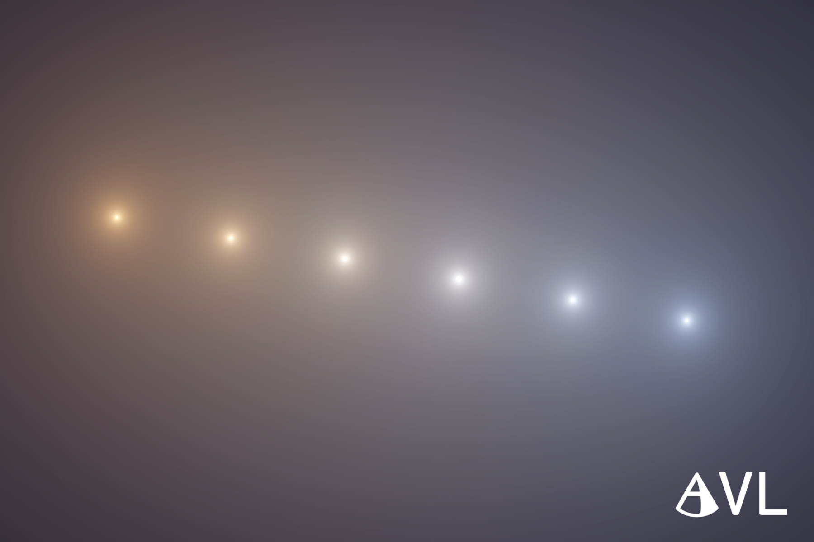

# UnityPackage-AnalyticalVolumetricLighting-Public

This is an issue and demo repository for the Analytical Volumetric Lighting Unity package.

View [Issues](https://github.com/akidevcat/UnityPackage-AnalyticalVolumetricLighting-Public/issues) page to leave a problem, suggestion, or ask for technical support.
